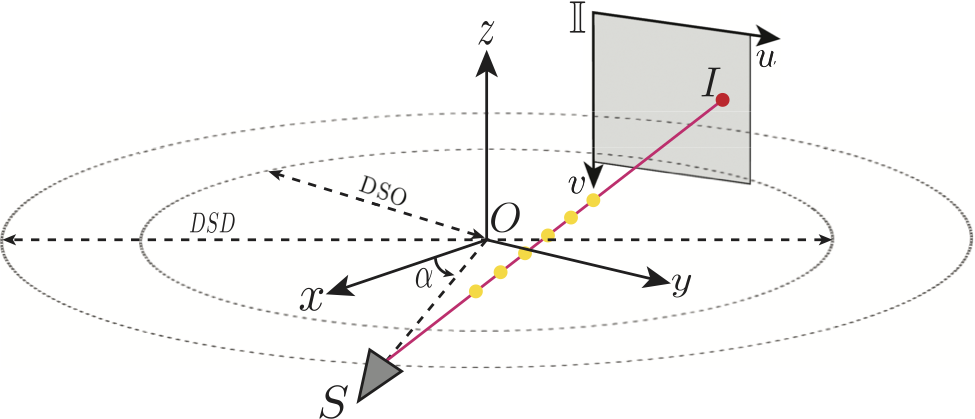

### Coordinate System

The coordinate system in circular cone-beam X-ray scanning follows the OpenCV standards.
<div align="center">
<p align="center">  </p>
</div>

&nbsp;

## 1. Create Environment:

We recommend using [Conda](https://docs.conda.io/en/latest/miniconda.html) to set up an environment.

``` sh
# Create environment
conda create -n sax_nerf python=3.9
conda activate sax_nerf

# Install pytorch (hash encoder requires CUDA v11.3)
pip install torch==1.11.0+cu113 torchvision==0.12.0+cu113 torchaudio==0.11.0 --extra-index-url https://download.pytorch.org/whl/cu113

# Install other packages
pip install -r requirements.txt
```

We suggest you install TIGRE toolbox (2.3 version) for executing traditional CT reconstruction methods and synthesize your own CT data if you plan to do so. Please note that TIGRE v2.5 might stuck when CT is large.
``` sh
# Download TIGRE
wget https://github.com/CERN/TIGRE/archive/refs/tags/v2.3.zip
unzip v2.3.zip
rm v2.3.zip

# Install TIGRE
pip install cython==0.29.25
pip install numpy==1.21.6
cd TIGRE-2.3/Python/
python setup.py develop
```

&nbsp;

## 2. Prepare Dataset:

Download our processed datasets from [OneDrive](https://studentuml-my.sharepoint.com/:f:/g/personal/yongtong_liu_student_uml_edu/EqyqNTlF081BvcSFyMPgygMBZ_Y-D7cEKdVlWoXycMTsxw?e=POO0TB). Then put the downloaded datasets into the folder `data/` as

```sh
  |--data
      |--chest_50.pickle
      |--aneurism_50.pickle
      |--bonsai_50.pickle
      |--foot_50.pickle
      |--jaw_50.pickle
```

&nbsp;

## 3. Training:

`dataGenerator/image_init.py` and `src/render/matcher.py` are released for attenuation initialization and matching respectively. We provide the training logs on all scenes for your convenience to debug. Please download the training logs from [OneDrive](https://studentuml-my.sharepoint.com/:f:/g/personal/yongtong_liu_student_uml_edu/EqyqNTlF081BvcSFyMPgygMBZ_Y-D7cEKdVlWoXycMTsxw?e=POO0TB).

```sh
# SAX-NeRF
python train_mlg.py --config config/Lineformer/chest_50.yaml

# NeRF
python train.py --config config/nerf/chest_50.yaml
```


&nbsp;

## Acknowledgements
This work builds upon the SAX-NeRF implementation [caiyuanhao1998/SAX-NeRF](https://github.com/caiyuanhao1998/SAX-NeRF) by Yuanhao Cai et al and [Ruyi-Zha/naf_cbct](https://github.com/Ruyi-Zha/naf_cbct) by Ruyi Zha et al.

## Citation
If this repo helps you, please consider citing our works:

```tex
# SAX-NeRF
@inproceedings{sax_nerf,
  title={Structure-Aware Sparse-View X-ray 3D Reconstruction},
  author={Yuanhao Cai and Jiahao Wang and Alan Yuille and Zongwei Zhou and Angtian Wang},
  booktitle={CVPR},
  year={2024}
}

@inproceedings{zha2022naf,
  title={NAF: neural attenuation fields for sparse-view CBCT reconstruction},
  author={Zha, Ruyi and Zhang, Yanhao and Li, Hongdong},
  booktitle={International Conference on Medical Image Computing and Computer-Assisted Intervention},
  pages={442--452},
  year={2022},
  organization={Springer}
}
```

